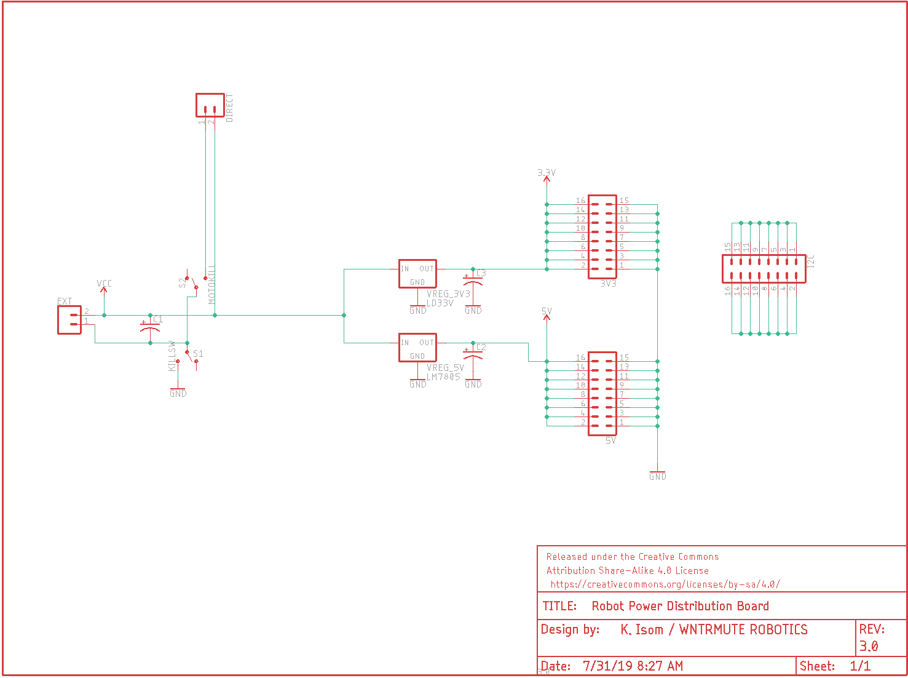
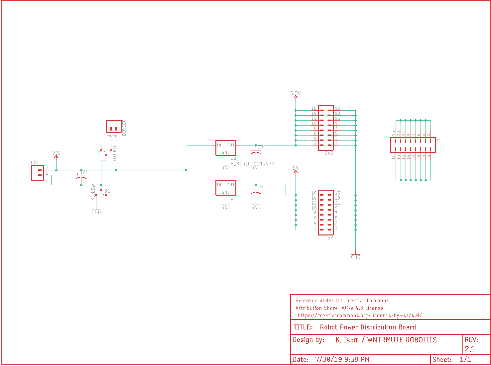

# Robot Power Distribution Board

This is a simple power distribution board that offers direct output to a motor controller, stable 5V and 3.3V rails, and an I2C expander.

## Version history

* 4.0 - added power and motor LEDs with SMD resistors
* 3.0 - updated silkscreen to improve capacitor placement
* 2.0 - first working prototype.

## Specifications

* Input voltage: 6-24V
* Max current: 1.2A draw through the 5V and 3.3V rails

## Version 4.0

Schematic: 

## Version 3.0

Schematic:

## Version 2.0

